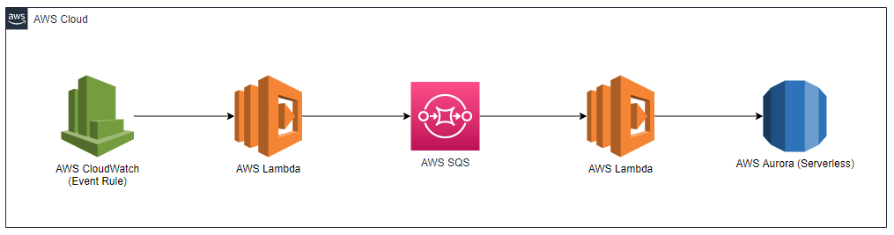

# Daflytic

An AWS serverless application using Terraform to scrape rental properties in Limerick daily thats cost effective.

<center>



_SQS isn't necessary since the number of properties in Limerick are normally low and you can invoke another Lambda from Lambda._

</center>

<hr>

## Deployment 🔧

```bash
terraform init
terraform apply

# To tear down the deployment run: terraform destory
```

<hr>

## Components 🧰

### Rent Search 🔍

Is triggered daily at 6PM by an Event Rule. It retrieves each hyperlink available under property for rent in Limerick and sends it to SQS.

### Rent Extract 📝

Is triggered by the SQS event source mapping, extracts the property informations and stores it in Aurora (serverless).

<hr>

## Query Database 💾

```bash
>aws secretsmanager list-secrets
{
    "SecretList": [
        {
            "ARN": "arn:aws:secretsmanager:...",
            "Name": "rent_credentials",
            "LastChangedDate": "2021-10-17T18:25:38.883000+01:00",
            "LastAccessedDate": "2021-10-19T01:00:00+01:00",
            "SecretVersionsToStages": {
                ...
            }
        }
    ]
}

# Copy the arn, the --filter command never works for me 🤔.

>aws rds describe-db-clusters --query "DBClusters[?DatabaseName==`rentServerlessMysql`].DBClusterArn"
[
    "arn:aws:rds:...."
]

>aws rds-data execute-statement
    --resource-arn arn:aws:rds:...
    --secret-arn arn:aws:secretsmanager:...
    --database rentServerlessMysql
    --sql "select * from property LIMIT 1;"
    --region eu-...

# It should come back with a Communications link failure (this means the database is asleep and will start waking up. Give it 30 seconds.)
An error occurred (BadRequestException) when calling the ExecuteStatement operation: Communications link failure

The last packet sent successfully to the server was 0 milliseconds ago. The driver has not received any packets from the server.

# Try again
>aws rds-data execute-statement
    --resource-arn arn:aws:rds:...
    --secret-arn arn:aws:secretsmanager:...
    --database rentServerlessMysql
    --sql "select * from property LIMIT 1;"
    --region eu-...
```

### Query Result 📋

```json
{
  "numberOfRecordsUpdated": 0,
  "records": [
    [
      {
        "longValue": 5
      },
      {
        "stringValue": "Somewhere, Somewhere, Co. Limerick"
      },
      {
        "longValue": 2568
      },
      {
        "stringValue": "Apartment"
      },
      {
        "stringValue": "4 Bed"
      },
      {
        "stringValue": "3 Bath"
      },
      {
        "stringValue": "C1"
      },
      {
        "stringValue": ""
      },
      {
        "stringValue": "[{\"label\": \"Double Bedroom\", \"text\": \"4\"}, {\"label\": \"Bathroom\", \"text\": \"3\"}, {\"label\": \"Available From\", \"text\": \"Immediately\"}, {\"label\": \"Furnished\", \"text\": \"Yes\"}, {\"label\": \"Lease\", \"text\": \"Minimum 1 Year\"}]"
      },
      {
        "stringValue": "2021-10-17 20:42:37"
      }
    ]
  ]
}
```

## Boring Stuff 🙄

Daft does not allow scraping of its site therefore you will need to explicity ask them for permission.
